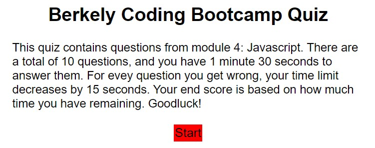

# BCB Quiz

## Purpose
This project was my second in-depth encounter with JavaScript. The website consist of 10 quesitons about Javascript and and limits the user
to solve the quiz in under 180 seconds. The score is based on how many seconds left the user has at the end of the quiz and stores the highest
score. To create this application, I went further in-depth in objects, localStorage, timers, modifying/creating HTML elements with JS, 
element selectors, and event listeners. 

## Built With
* HTML
* CSS
* JavaScript

## Website
https://magoofy.github.io/bcb-quiz/

## Contribution

Me, Myself, and I - Afi Akau

